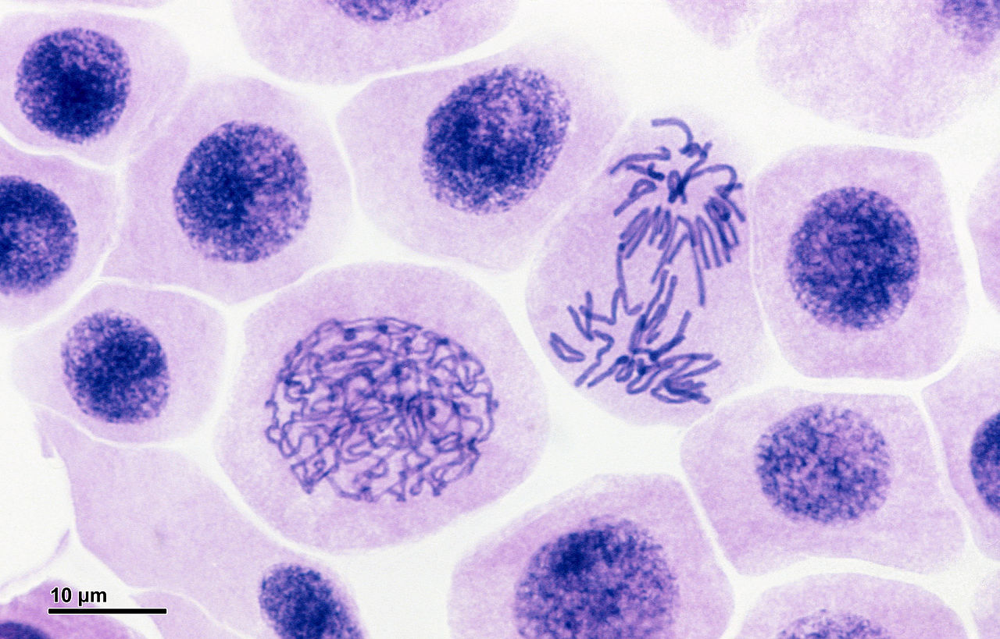

I am learning web development at an *amazing* bootcamp by [Tealeaf Academy][tl] and accumulated a lot of micro-projects in subfolders of one giant repository. This was OK at first. But as soon as I graduated to building larger apps, they started crying for their own repos.

Now, how do I do this without losing the commits history? Just moving the files to a new folder and doing `git init` there wouldn't help. I dug around and discovered a rather new `git subtree` command that did most of the trick. I wrote this step-by-step guide in case I ever need to go through this hassle again...

1. Go to the old repo folder and split a sub-folder into a separate branch:

    ~~~console
    $ cd <old-repo-main-folder>
    $ git subtree split -P <sub-folder> -b <new-branch-name>
    ~~~

2. Set up the new repo folder git-pulling the newly created branch there:

    ~~~console
    $ cd ..
    $ mkdir <new-repo-folder>
    $ cd <new-repo-folder>
    $ git init
    $ git pull </path/to/old-repo-main-folder> <new-branch-name>
    ~~~

3. Get a personal API token on GitHub and create a new remote repo:  
*Alternatively, skip this step and just create a new repo through GitHub interface*

    First, follow these [GutHub instructions][token] to generate the API token, if you do not have one already. Then in your terminal:

    ~~~console
    $ curl -u <git-username>:<git-api-token> \
       https://api.github.com/user/repos -d '{"name":"<new-repo-name>"}'
    ~~~

4. Link the new GitHub repo to the new folder:  
*This assumes you use SSH access to GitHub. Change the first line accordingly if you actually use HTTPS.*

    ~~~console
    $ git remote add origin git@github.com:<git-username>/<new-repo>.git
    $ git push origin -u master
    ~~~

5. Remove the sub-folder from the old repo:

    ~~~console
    $ cd <old-repo-main-folder>
    $ git rm -rf <sub-folder>
    $ rm -r <sub-folder>
    $ git commit -m "Split sub-folder <sub-folder> into a new repo <new-repo-name>."
    $ git push
    ~~~

6. Enjoy your shining clean new repo. ))

>Found this helpful? Share on your favorite social network to let your friends know.

[token]: https://github.com/blog/1509-personal-api-tokens
[tl]: http://www.gotealeaf.com/
